# How to modify the texture of an moded item.
If you have a greate mod installed, but one of the blocks dosn't relly fit in your game,
so you decide to change it texture, here is how to do that.

## 1. Find the orignal texture file
To modify an item, it may be easier to start from the original image.

## 1.1a Find the image in the source-code on github.
If the mod is avaible on curseforge.com, there is a chans that there also is a link to the source-code.  
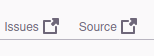

Both the "Source"- and the "Issues"-links may take you to the source on github.

Navigate to the tab "Code", and then to the Folders:
* src
* main
* resources
* assets
* (name of mod)
* textures
* block (if its a block texture you wanted to modify)  
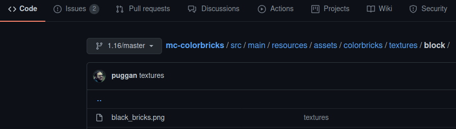

Select the texture-file and download it with the download-button.

## 1.1b Find the image in the jar-file, by renaming it
On the website you downloaded the mod from, 
right-click the download-link and select "Save link as...",
and instead of the sugested name like "modname-version.jar",
add ".zip" at the end like "modname-version.jar.zip".

Open the zip-file, and navigate to the Folders:
* assets
* (name of mod)
* textures
* block (if its a block texture you wanted to modify)  
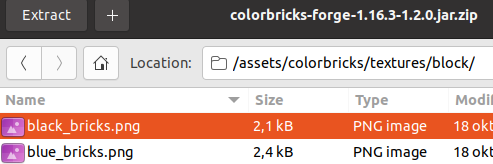

Copy (extract) the texture-file you wants to modify.

## 1.1c Find the image in the jar-file, without renaming it.
Most archive manager, can open jar-file, even if they not automaticly adds them self as an options for that file-type.
Either select the file and select "Open with...", and select the archive manager,
or first open the archive manager, and then from there open the jar file.

After opening it, the path is the same as in 1.1b above.

## 2. Modify the file
Open the texture file in your image-editing tool, Gimp is one example.
You may resize the image by dubbling or halving the image in the range from 16&times;16 to 1024&times;1024.

## 3. Create a resource pack
Open your minecraft folder, there is a button for it in the launcher:  
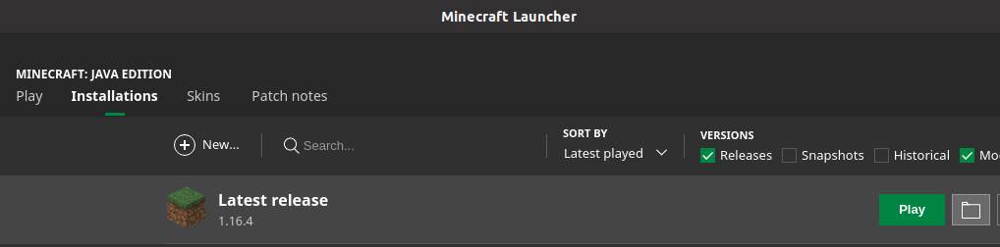
In the game there is an "Open pack folder"-button too.  
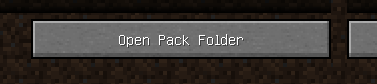

Inside the "resourcepacks"-folder, inside the minecraft-folder, create a new folder with a good name, or "homemade-pack".
Inside your new pack-folder, add a file named `pack.mcmeta`, with the following content:
```
{"pack":{"pack_format":6,"description":"homemade-pack"}}
```
For windows user, notepad can save non-formated textfile, when you save the file, use `"` around the name, to avoid getting `.txt` automaticly added.
This file is what minecraft use to detect it is a resource-pack, so if you fail this step, the resource-pack is not going to be listed in the game.
(The screenshoot have an old pack-format, should be 6 for version 1.6.2+)  
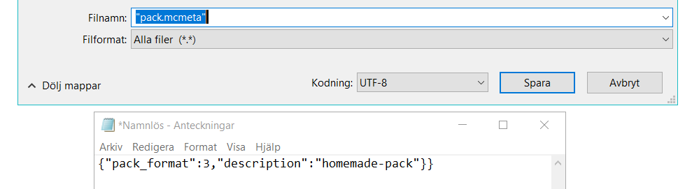

Or you can just download mine [pack.mcmeta](./pack.mcmeta)

In your resource-pack folder you also need an "assets"-folder.  
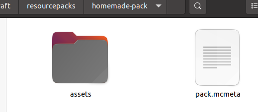

Inside the asset-folder you need a folder named as the mod (just like where you found the texture), 
and in that a folder named "textures", and in that a "blocks" folder or what type of texture you was modifing.
And that deep in, you put your modified image, and name it just as you found it.
So basicly if you found the image at `assets/colorbricks/textures/block/pink_bricks.png` inside the jar or resource-folder,
then the modifed image should be found at your resource-pack folder at `assets/colorbricks/textures/block/pink_bricks.png`.  
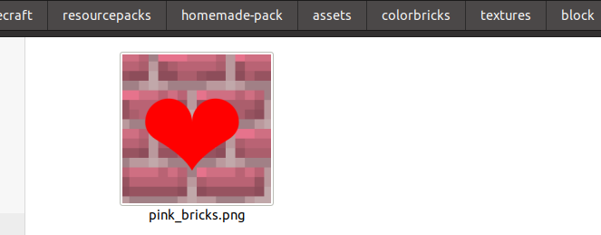

## 4. Test your new resource pack
Start Minecraft, and open the Resource-pack-view ("Options..."-button followed by "Resource Packs..."-button")
You should find your pack in there on the avaible side.  
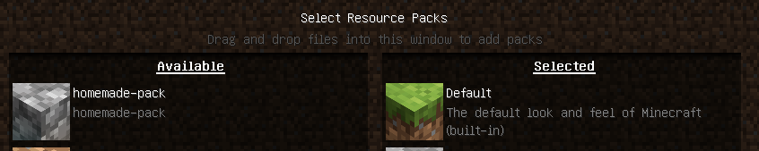

Press it to activate it, so its moves over to the other side:  
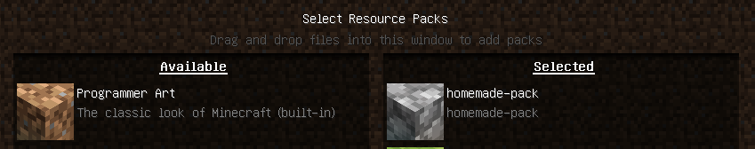

Start the game and use your block:  
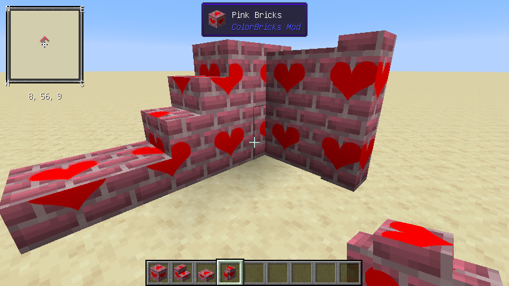

## 5. Extra: Add a pack-image
By adding another image-file named `pack.png` besides the `pack.mcmeta`-file,
you get an icon in the in-game resource-pack selector:  
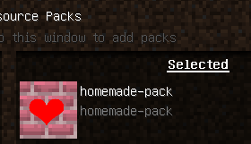

## 6. Extra: Sugest that your image replace the original one (github)
If your modification made the block look better, and you think everyone using the mod should have this new look when they play,
you can add your image as a sugestion to the developer.

Make sure you are logged in at [github](https://githib.com/), creat a free account if you don't already have one.

Find the repository with the mod in, see 1.1a above.

Use the "Fork"-button to make your own copy of the code.  
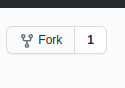

You should end up at an almost identical page, but with your username infront fo the repository-name.  
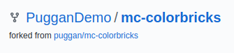

Navigate to the folder where the images are, again see 1.1a above,
and press the "Add file"-button followed by the "Upload files"-button.  


Select your new file, write a note about your change, (this ends up in the history),
and name your new branch.
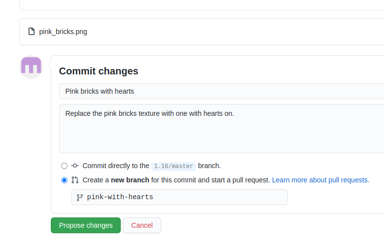

On the "Open a pull request"-page, start with clicking the "compare across forks"-link/button.
In the 4 dropdowns select the original developers repository from the first dropdown.
The other dropdown should be correct.  
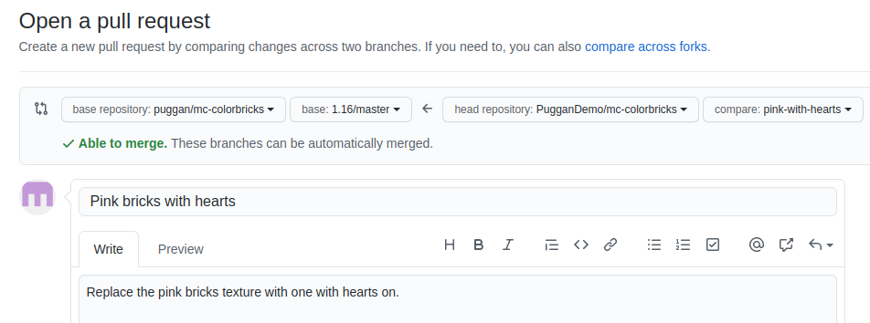

Press the "Create Pull Request"-button.

Tada you sent a request to replace the texture with your own texture.

The exemple above can be view in [github.com/puggan/mc-colorbricks/pull/7](https://github.com/puggan/mc-colorbricks/pull/7)
